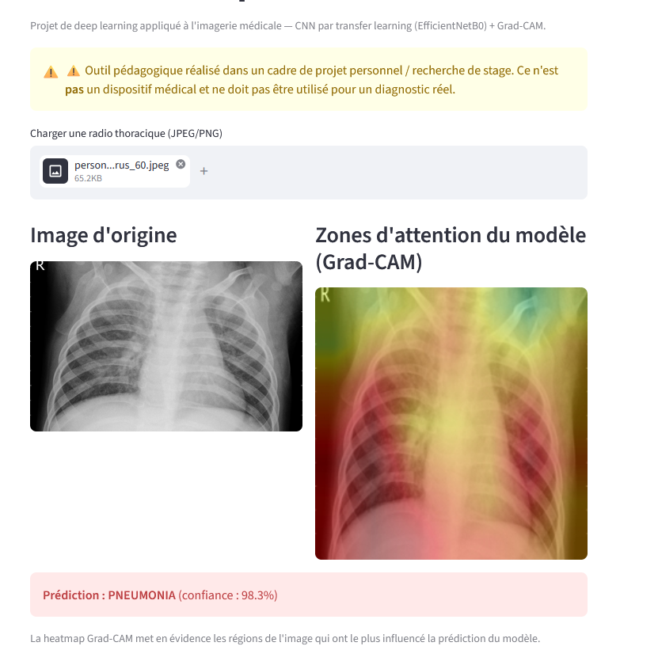

# Détection de pneumonie sur radios thoraciques

Projet de deep learning appliqué à l'imagerie médicale : détecter une pneumonie à
partir d'une radiographie thoracique, par transfer learning (CNN pré-entraîné) avec
explicabilité visuelle (Grad-CAM) et interface de démonstration interactive.

Complémentaire au projet [stroke-risk-predictor](../stroke-risk-predictor) : même
démarche (pipeline complet, interprétabilité, démo Streamlit) appliquée à une autre
modalité de données (image vs tabulaire) et une autre famille de modèles (deep
learning vs ML classique).

⚠️ **Disclaimer** : outil pédagogique réalisé dans un cadre de projet personnel /
recherche de stage. Ce n'est **pas** un dispositif médical et ne doit pas être
utilisé pour un diagnostic réel.



## Dataset

[Chest X-Ray Images (Pneumonia) — Kaggle](https://www.kaggle.com/datasets/paultimothymooney/chest-xray-pneumonia),
~5800 radios thoraciques réparties en `NORMAL` / `PNEUMONIA`. À télécharger et
placer dans `data/raw/chest_xray/` (sous-dossiers `train/`, `val/`, `test/`).

Le dossier `val/` officiel ne contient que 16 images : le pipeline reconstruit une
validation fiable par split stratifié de `train/` (voir `src/preprocessing.py`).

## Approche

- **Modèle** : EfficientNetB0 pré-entraîné sur ImageNet, tête de classification
  personnalisée (GlobalAveragePooling + Dense), entraînement en deux phases :
  1. base gelée (entraînement de la tête uniquement)
  2. fine-tuning des dernières couches de la base à faible learning rate
- **Déséquilibre de classes** : pondération des classes (`class_weight`) plutôt que
  du sur-échantillonnage, plus adapté aux données image.
- **Explicabilité** : Grad-CAM pour visualiser les zones de l'image ayant le plus
  influencé chaque prédiction.

## Résultats

Évaluation du modèle retenu (meilleur point sur la validation, `val_AUC` = 0.993) sur
le jeu de test officiel de 624 radios, jamais vu pendant l'entraînement :

| Classe | Precision | Recall | F1 |
|---|---|---|---|
| NORMAL | 0.93 | 0.80 | 0.86 |
| PNEUMONIA | 0.89 | **0.96** | 0.92 |

**ROC-AUC : 0.961** — accuracy : 0.90.

Comme pour le projet AVC, le recall sur la classe malade est le critère prioritaire :
en contexte médical, rater une pneumonie (faux négatif) est plus grave que déclencher
une fausse alerte. Le modèle détecte 96 % des pneumonies, au prix de quelques fausses
alertes sur radios normales (recall NORMAL de 0.80).

Observations :
- Le fine-tuning des dernières couches n'a pas amélioré la validation par rapport à
  l'entraînement de la tête seule ; le meilleur modèle vient de la phase 1.
- L'écart entre la validation (AUC 0.99) et le test (AUC 0.96) est connu sur ce
  dataset : le jeu de test provient d'une distribution légèrement différente.
- Entraînement réalisé sur CPU (~25 min pour 8 epochs).

## Stack

- TensorFlow / Keras : transfer learning (EfficientNetB0)
- scikit-learn : métriques, pondération des classes
- OpenCV : génération des heatmaps Grad-CAM
- Streamlit : interface de démo

## Structure

```
radio_thoracique/
├── data/
│   ├── raw/                 # dataset brut (non versionné)
│   └── processed/
├── notebooks/
│   └── 01_eda.ipynb         # exploration des données
├── src/
│   ├── preprocessing.py     # générateurs d'images (train/val/test)
│   ├── train.py             # entraînement (transfer learning + fine-tuning)
│   ├── gradcam.py           # génération des heatmaps Grad-CAM
│   └── predict.py           # chargement modèle + prédiction
├── models/
│   └── best_model.keras     # modèle entraîné (généré par train.py)
├── app/
│   └── streamlit_app.py     # interface de démo (upload + Grad-CAM)
└── requirements.txt
```

## Installation

```bash
python -m venv venv
venv\Scripts\activate
pip install -r requirements.txt
```

## Utilisation

1. Télécharger le dataset Kaggle et le placer dans `data/raw/chest_xray/`.
2. Explorer les données : ouvrir `notebooks/01_eda.ipynb`.
3. Entraîner le modèle :
   ```bash
   python src/train.py
   ```
4. Lancer la démo :
   ```bash
   streamlit run app/streamlit_app.py
   ```

## Roadmap

- [x] Structure du projet et pipeline de chargement des images
- [x] Modèle par transfer learning (EfficientNetB0) + fine-tuning
- [x] Grad-CAM pour l'explicabilité
- [x] Interface Streamlit
- [x] Entraînement effectif et résultats chiffrés
- [ ] Déploiement sur Streamlit Community Cloud
